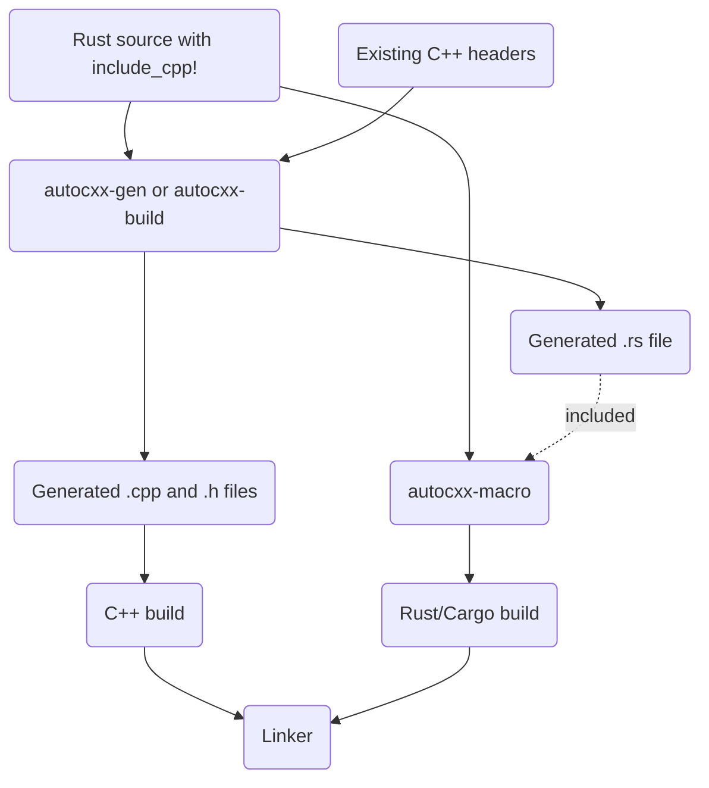

# Building

## Building if you're using cargo

The basics of building in a `cargo` environment are explained in [the tutorial](tutorial.md).

If your build depends on later editions of the C++ standard library, you will need to ensure that both `libclang` and the compiler are sent the appropriate flag, like this:

```rust,ignore
fn main() {
    let path = std::path::PathBuf::from("src"); // include path
    let mut b = autocxx_build::Builder::new("src/main.rs", &[&path])
        .extra_clang_args(&["-std=c++17"])
        .expect_build();
    b.flag_if_supported("-std=c++17")
        .compile("autocxx-demo"); // arbitrary library name, pick anything
    println!("cargo:rerun-if-changed=src/main.rs");
    // Add instructions to link to any C++ libraries you need.
}
```

## Building - if you're not using cargo

See the `autocxx-gen` crate. You'll need to:

* Run the `codegen` phase. You'll need to use the [`autocxx-gen`](https://crates.io/crates/autocxx-gen)
  tool to process the .rs code into C++ header and
  implementation files. This will also generate `.rs` side bindings.
* Educate the procedural macro about where to find the generated `.rs` bindings. Set the
  `AUTOCXX_RS` environment variable to a list of directories to search.
  If you use `autocxx-build`, this happens automatically. (You can alternatively
  specify `AUTOCXX_RS_FILE` to give a precise filename as opposed to a directory to search,
  though this isn't recommended unless your build system specifically requires it
  because it allows only a single `include_cpp!` block per `.rs` file.) See `gen --help`
  for details on the naming of the generated files.



This interop inevitably involves lots of fiddly small functions. It's likely to perform far better if you can achieve cross-language link-time-optimization (LTO). [This issue](https://github.com/dtolnay/cxx/issues/371) may give some useful hints - see also all the build-related help in [the cxx manual](https://cxx.rs/) which all applies here too.
