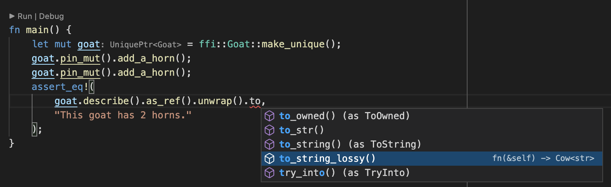
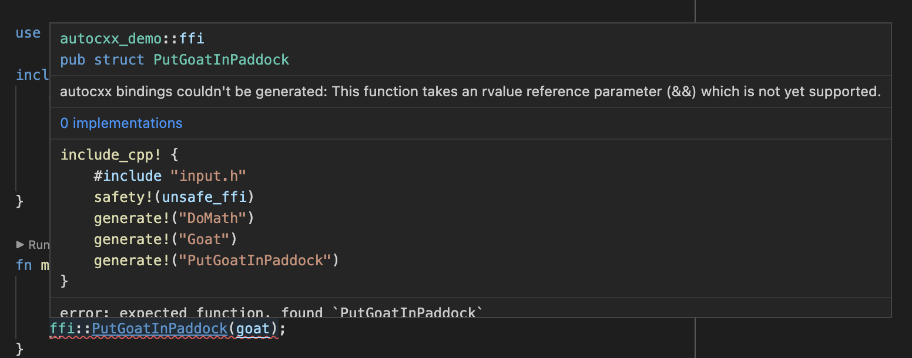

# Workflow

C++ is complex, and `autocxx` can't ingest everything.

First tip - use an IDE. Type annotation and autocompletion is _incredibly_ helpful in an `autocxx`
context, where you may be dealing with `UniquePtr<T>` and `Option<&T>` and `Pin<&mut T>` very often.


As you'll see, it's also _essential_ when `autocxx` can't produce bindings for some reason.

## What if `autocxx` can't generate bindings?

This bit is important.

When you use `autocxx`, you'll ask it to generate Rust bindings for [C++ types or functions](allowlist.md) using
`generate!` directives.

If you ask to generate bindings for a specific function, and it can't: the build will fail.

If you ask to generate bindings for an entire type, `autocxx` will generate bindings for as
many methods as possible. For those methods where it can't generate bindings, it will instead
generate some placeholder function or struct with documentation explaining what went wrong:



_This_ is why it's crucial to use an IDE with `autocxx`. (Alternatively, you can use
`cargo expand`, but it's unpleasant.)

## How to work around cases where `autocxx` can't generate bindings

Your options are:

* Write extra C++ functions with simpler parameters or return types, and generate
  bindings to them, instead.
* Write some manual `#[cxx::bridge]` bindings - see below.

## Mixing manual and automated bindings

`autocxx` uses [`cxx`](https://cxx.rs) underneath, and its build process will happily spot and
process manually-crafted [`cxx::bridge` mods](https://cxx.rs/concepts.html) which you include in your
Rust source code. A common pattern could be to use `autocxx` to generate
all the bindings possible, then hand-craft a `cxx::bridge` mod for the
remainder where `autocxx` falls short.

To do this, you'll need to use the [ability of one cxx::bridge mod to refer to types from another](https://cxx.rs/extern-c++.html#reusing-existing-binding-types),
for example:

```rust,ignore
autocxx::include_cpp! {
    #include "foo.h"
    safety!(unsafe_ffi)
    generate!("take_A")
    generate!("A")
}
#[cxx::bridge]
mod ffi2 {
    unsafe extern "C++" {
        include!("foo.h");
        type A = crate::ffi::A;
        fn give_A() -> UniquePtr<A>; // in practice, autocxx could happily do this
    }
}
fn main() {
    let a = ffi2::give_A();
    assert_eq!(ffi::take_A(&a), autocxx::c_int(5));
}
```

## My build entirely failed

`autocxx` should nearly always successfully parse the C++ codebase and
generate _some_ APIs. It's reliant on `bindgen`, but `bindgen` is excellent
and rarely bails out entirely.

If it does, you may be able to use the [`block!` macro](https://docs.rs/autocxx/latest/autocxx/macro.block.html).

We'd appreciate a minimized bug report of the troublesome code - see [contributing](contributing.md).


## Enabling autocompletion in a rust-analyzer IDE

You'll need to enable _both_:
* Rust-analyzer: Proc Macro: Enable
* Rust-analyzer: Experimental: Proc Attr Macros

## Next steps

Now you've read what can go wrong with `autocxx`, and how to diagnose problems - the next step is to give it a try!
Treat the rest of this manual as a reference.
